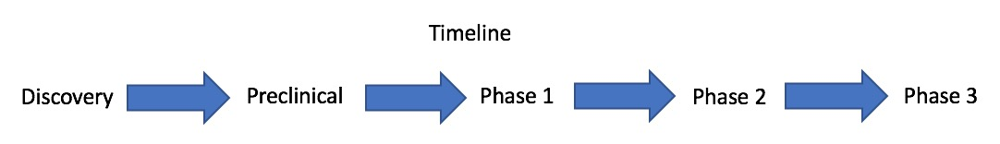

\

#**IFM Therapeutics (potential competitive strength):  **  
Antagonists of the cGAS-STING Pathway:   
The molecules that IFM is developing to block the cGAS/STING pathway will be useful to treat diseases that result from abnormal signals induced by cytosolic DNA, including both rare autoinflammatory and autoimmune diseases like Aicardi-Goutières syndrome and more common conditions such as systemic lupus erythematosus, in which excessive type interferon signaling drives disease. 

#**Pipeline**  

For more details, check the reference below.

# Reference     
https://www.ifmthera.com/pipeline/

